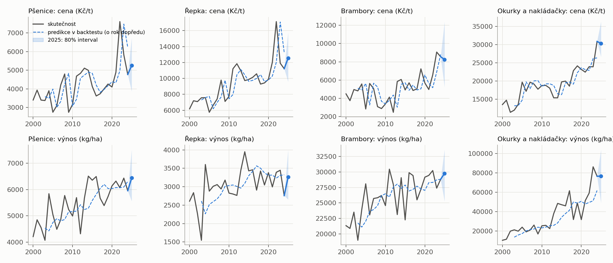
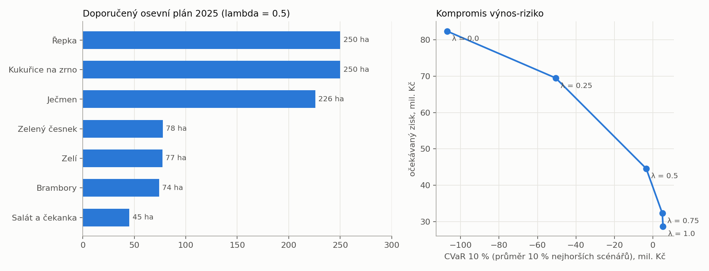
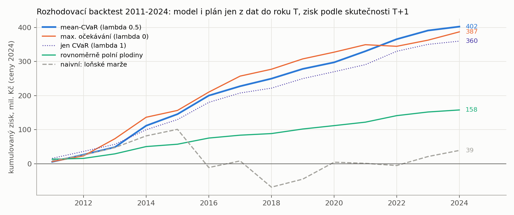
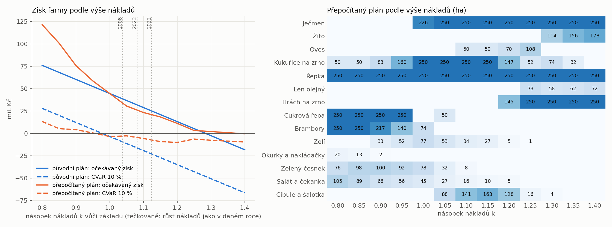
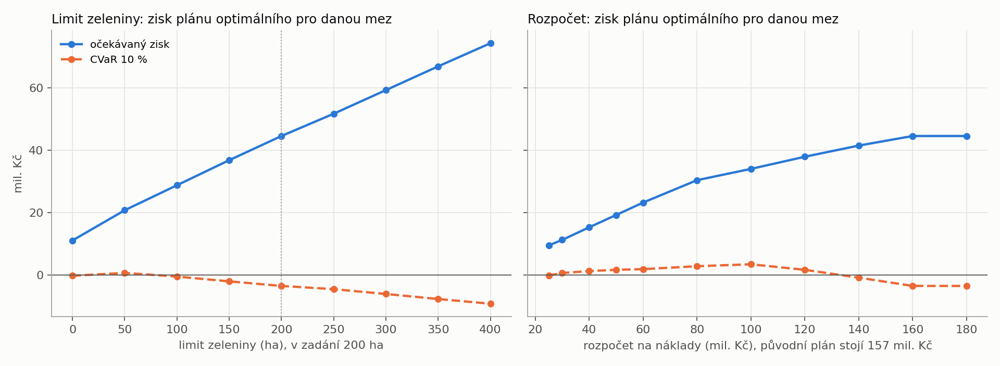

# Návrh osevního plánu 2025

Případové studie I, FIS VŠE, ZS 2026/2027. **Tým B:** Vanessa Bergová, Daniel Garba, Aneta Lipová, Petr Lupínek, Filip Stupár.

Farma má 1 000 ha a vybírá z 20 plodin. Úkolem je predikovat ceny a výnosy na sezónu 2025 (data končí rokem 2024) a rozdělit půdu s ohledem na očekávaný zisk a riziko. Zadání přišlo ve dvou částech:

| Část | Zadání | Co se řeší | Stav |
|---|---|---|---|
| 1 | [`zadani/osevni_plan_1.pdf`](zadani/osevni_plan_1.pdf) | marže 2024, predikce cen a výnosů, osevní plán | hotovo, executive summary odevzdané (`Odevzdání/`) |
| 2 | [`zadani/osevni_plan_2.pdf`](zadani/osevni_plan_2.pdf) | náklady, limit zeleniny a rozpočet jsou nejisté: scénáře nákladů, úprava modelu, stabilita plánu | výpočty hotové, executive summary je potřeba napsat |

## Kde začít

| Potřebuju | Otevři |
|---|---|
| napsat executive summary nebo slidy k doplnění zadání | [`PODKLADY_EXECUTIVE_SUMMARY.md`](PODKLADY_EXECUTIVE_SUMMARY.md): výsledky, rozhodnutí a jejich důvody, limity, otázky, návrh formulací |
| pochopit doplnění zadání do detailu (vzorce s dosazením) | [`osevni_plan/DOPLNENI_ZADANI.md`](osevni_plan/DOPLNENI_ZADANI.md) |
| pochopit predikce a původní plán | [`osevni_plan/VYSVETLENI.md`](osevni_plan/VYSVETLENI.md) |
| tabulky a grafy | `osevni_plan/vystupy/` (část 1), `osevni_plan/vystupy/doplneni/` (část 2) |
| variantu s dělením na pole a mezemi | [`osevni_plan_pole/VYSVETLENI.md`](osevni_plan_pole/VYSVETLENI.md) |
| to, co jsme odevzdali v první části | `Odevzdání/` |

## Výsledek v kostce

|  | původní plán (1. část) | **odolný plán (doporučený po doplnění)** |
|---|---|---|
| Ječmen (ha) | 226 | **250** |
| Kukuřice na zrno (ha) | 250 | **250** |
| Řepka (ha) | 250 | **250** |
| Cukrová řepa (ha) | 0 | **50** |
| Brambory (ha) | 74 | **0** |
| Zelí (ha) | 77 | **54** |
| Zelený česnek (ha) | 78 | **31** |
| Salát a čekanka (ha) | 45 | **26** |
| Cibule a šalotka (ha) | 0 | **89** |
| náklady plánu (mil. Kč) | 156,9 | **109,8** |
| základní náklady: očekávaný zisk / CVaR 10 % (mil. Kč) / P(ztráta) | 44,6 / −3,4 / 6,5 % | **35,9 / 2,9 / 2,3 %** |
| růst nákladů jako 2022: očekávaný zisk / CVaR 10 % (mil. Kč) / P(ztráta) | 25,1 / −22,9 / 25,9 % | **22,3 / −10,7 / 15,7 %** |
| největší lítost přes scénáře růstu nákladů (mil. Kč) | 5,65 | **1,15** |

CVaR 10 % je průměrný zisk v 10 % nejhorších scénářů. Lítost říká, o kolik je plán v daném scénáři horší než plán optimální přímo pro ten scénář.

- **Původní plán** je řešení první části. Je optimální, pokud náklady vyjdou podle farmářova odhadu.
- **Odolný plán** je náš návrh po doplnění zadání. Proti původnímu obětuje 8,7 mil. Kč očekávaného zisku, ale stojí o 47 mil. Kč méně a při růstu nákladů ztrácí méně často.
- Řepka, ječmen a kukuřice po 250 ha jsou stabilní část plánu. Zelenina a brambory závisí na nákladech, limitu zeleniny a rozpočtu.

> Doporučení odolného plánu je návrh k diskusi ve skupině.

## Struktura repozitáře

```
README.md                         tento rozcestník
PODKLADY_EXECUTIVE_SUMMARY.md     podklady pro executive summary a slidy k části 2
zadani/                           obě prezentace se zadáním
data/                             vstupní data (FAOSTAT, ČSÚ, počasí, makro)
marze_2024/                       část 1a: skript a tabulka marží 2024
osevni_plan/                      hlavní řešení: predikce, optimalizace, doplnění zadání
    VYSVETLENI.md                 část 1 podrobně
    DOPLNENI_ZADANI.md            část 2 podrobně
    data.py, modely.py, backtest.py, optimalizace.py, naklady_rozpocet.py, spust.py
    test_reseni.py                20 testů
    vystupy/                      hlavní tabulky a grafy části 1
    vystupy/detaily/              podpůrné tabulky, vysledky.json
    vystupy/doplneni/             tabulky a grafy části 2
osevni_plan_pole/                 doplňková varianta: dělení na pole a meze (MILP)
Odevzdání/                        odevzdané materiály k části 1 (executive summary, skript marží)
```

## Spuštění

Python 3.10 nebo novější.

```bash
pip install -r osevni_plan/requirements.txt
python3 marze_2024/compute_margins_2024.py     # část 1a
python3 osevni_plan/spust.py                   # predikce, plán a doplnění zadání (asi 2 minuty, většinu zabere backtest ARIMA)
python3 -m pytest osevni_plan/test_reseni.py -q
python3 osevni_plan_pole/spust_pole.py         # varianta s poli
```

---

## Část 1a: referenční marže 2024

$M_i = P_i \cdot Y_i / 1000 - C_i$ (cena Kč/t × výnos kg/ha / 1000 − náklady Kč/ha)

Příklad, pšenice: $4\,772 \cdot 5\,956{,}7 / 1000 - 25\,000 = 3\,425$ Kč/ha.

| Plodina | Cena (Kč/t) | Výnos (kg/ha) | Náklady (Kč/ha) | **Marže (Kč/ha)** |
|---|---:|---:|---:|---:|
| Rajčata | 46 297 | 232 667 | 10 652 000 | **119 770** |
| Okurky a nakládačky | 30 891 | 76 593 | 2 276 000 | **90 022** |
| Salát a čekanka | 51 956 | 25 108 | 1 234 000 | **70 496** |
| Papriky a chilli | 26 484 | 46 643 | 1 165 000 | **70 291** |
| Květák a brokolice | 32 265 | 18 087 | 534 000 | **49 577** |
| Mrkev a tuřín | 9 788 | 40 905 | 355 000 | **45 376** |
| Zelený česnek | 124 000 | 4 525 | 521 000 | **40 100** |
| Zelí | 8 996 | 33 921 | 270 000 | **35 143** |
| Cibule a šalotka | 11 363 | 23 325 | 230 000 | **35 047** |
| Brambory | 8 558 | 28 814 | 217 000 | **29 578** |
| Cukrová řepa | 914 | 69 560 | 54 000 | **9 578** |
| Kukuřice na zrno | 4 564 | 8 142 | 30 000 | **7 159** |
| Ječmen | 5 933 | 5 271 | 25 000 | **6 273** |
| Oves | 7 929 | 3 813 | 24 000 | **6 233** |
| Pšenice | 4 772 | 5 957 | 25 000 | **3 425** |
| Řepka | 11 217 | 2 758 | 28 000 | **2 932** |
| Slunečnice | 9 624 | 2 504 | 23 000 | **1 101** |
| Len olejný | 14 370 | 1 296 | 18 000 | **628** |
| Žito | 4 697 | 4 347 | 20 000 | **419** |
| Hrách na zrno | 6 221 | 1 670 | 12 000 | **−1 614** |

Marže je jen malá část tržby. U okurek je tržba 2,37 mil. Kč/ha a marže 90 tis. Kč/ha (3,8 %), takže pokles ceny o 10 % udělá z marže ztrátu 147 tis. Kč/ha. Proto musí plán pracovat s rizikem, nejen s průměrem.

---

## Část 1b: predikce 2025

1. **Modely.** Pracujeme s logaritmy cen a výnosů, porovnali jsme 6 modelů cen a 9 modelů výnosů (včetně ARIMA). Každý se porovnává s naivní predikcí („příští rok jako letos“).
2. **Test.** Používáme backtest s rolujícím počátkem: pro každý rok 2003–2024 se model odhadne jen z dřívějších dat a predikuje jeden rok dopředu. Metriky jsou MAE, CRPS (kvalita celého rozdělení) a pokrytí intervalů.
3. **Výběr.** Vybírá se model s nejnižší MAE přes všechny plodiny. Pro ceny i výnosy vychází **kombinace** dvou jednoduchých modelů:
   - ceny: průměr naivní predikce a návratu reálné ceny k 15letému průměru, o 5 % lepší než naivka,
   - výnosy: průměr trendu z 15 let a průměru z 5 let, o 16 % lepší než naivka.
4. **Nejistota.** Ročníkový bootstrap: scénář = chyby predikcí všech plodin z jednoho historického roku najednou. Tím se zachová to, že se ceny obilovin hýbou spolu (korelace 0,93). 5 000 scénářů roku 2025.
5. **Počasí a makro** jsme testovali. Predikci nezlepšily, a to ani kdybychom počasí roku 2025 znali dopředu.

Predikce bodově i s 80% intervaly: `osevni_plan/vystupy/predikce_2025.csv`.



---

## Část 1c: původní osevní plán 2025

Maximalizujeme $(1-\lambda)\,E[\text{zisk}] + \lambda\,\text{CVaR}_{10\%}[\text{zisk}]$, kde CVaR 10 % je průměrný zisk v 10 % nejhorších scénářů. Řeší se jako lineární program. Omezení: 1 000 ha celkem, zelenina ≤ 200 ha, jedna plodina ≤ 250 ha.

**Původní plán (λ = 0,5), odevzdaný v prvním executive summary:**

| Plodina | ha |
|---|---:|
| Kukuřice na zrno | 250 |
| Řepka | 250 |
| Ječmen | 226 |
| Brambory | 74 |
| Zelený česnek | 78 |
| Zelí | 77 |
| Salát a čekanka | 45 |

| (mil. Kč) | λ = 0 (jen průměr) | **λ = 0,5** | λ = 1 (jen riziko) |
|---|---:|---:|---:|
| očekávaný zisk | 82,4 | **44,6** | 28,7 |
| medián zisku | 35,4 | **36,3** | 27,7 |
| CVaR 10 % | −107,0 | **−3,4** | 5,3 |
| pravděpodobnost ztráty | 34 % | **6,5 %** | 1 % |



**Rozhodovací backtest 2011–2024.** Celý postup (výběr modelu, scénáře, optimalizace) jsme pustili pro každý rok jen s daty do předchozího roku a spočítali skutečný zisk plánu:

| Strategie | součet 2011–2024 (mil. Kč, ceny 2024) | ztrátové roky |
|---|---:|---:|
| **mean-CVaR, λ = 0,5** | **402** | 0 |
| max. očekávání, λ = 0 | 387 | 1 |
| mean-CVaR, výnosy tříletý průměr | 380 | 0 |
| plán podle loňských marží | 39 | 4 |
| rovnoměrně polní plodiny | 158 | 0 |



**Varianta s dělením na pole.** Složka `osevni_plan_pole/` ověřuje, jestli jde plán realizovat na polích do 30 ha s mezemi. Kvůli mezím se oseje 934 ha místo 1 000 (ubude hlavně ječmen, 180 místo 226 ha) a očekávaný zisk klesne ze 44,6 na 43,7 mil. Kč. Podrobnosti jsou v [`osevni_plan_pole/VYSVETLENI.md`](osevni_plan_pole/VYSVETLENI.md) a `HODNOCENI_KRITERII.md`.

---

## Část 2: doplnění zadání

Farmář přiznal, že náklady i limit zeleniny jsou jen hrubé odhady, bojí se rychlejšího růstu nákladů než cen a nezná rozpočet. Predikce cen a výnosů zůstávají stejné, mění se jen náklady a omezení. Podrobně v [`osevni_plan/DOPLNENI_ZADANI.md`](osevni_plan/DOPLNENI_ZADANI.md).

**Náklady.** Scénáře jsou ukotvené v historii: náklady porostou jako v letech 2008, 2023 nebo 2022, ceny plodin zůstanou podle modelu. Při růstu jako 2022 jsou náklady o 12,4 % vyšší než v základu ($1{,}151 / 1{,}024 = 1,124$). Chybu farmářova odhadu ukazujeme jako citlivost od −20 % do +40 %.

| Scénář | k | původní plán | plán přepočítaný pro scénář | odolný plán | společné ha (původní a přepočítaný) |
|---|---|---|---|---|---|
| základ (růst 2,4 %) | 1,000 | 44,6 / −3,4 / 6,5 % | 44,6 / −3,4 / 6,5 % | 35,9 / 2,9 / 2,3 % | 1000 |
| růst jako 2008 (6,3 %) | 1,038 | 38,6 / −9,4 / 11,4 % | 32,6 / −2,0 / 6,1 % | 31,7 / −1,3 / 5,3 % | 851 |
| růst jako 2023 (10,7 %) | 1,081 | 31,9 / −16,2 / 18,1 % | 26,0 / −4,6 / 8,6 % | 27,0 / −6,0 / 10,0 % | 811 |
| růst jako 2022 (15,1 %) | 1,124 | 25,1 / −22,9 / 25,9 % | 20,7 / −7,1 / 12,1 % | 22,3 / −10,7 / 15,7 % | 768 |

V buňkách je očekávaný zisk / CVaR 10 % (mil. Kč) / pravděpodobnost ztráty. Zdražení jen zeleniny o 20 % sníží její plochu v plánu z 200 na 40 ha, stejné zdražení polních plodin ji nezmění. Nejvíc tedy záleží na zpřesnění nákladů zeleniny.



**Limit zeleniny.** V modelu je nově parametr. Limit je aktivní v celém rozsahu 0 až 400 ha: kolik zeleniny limit povolí, tolik jí v plánu je. Hektar limitu navíc zvedne hodnotu plánu o 59 tis. Kč, ale zvyšuje riziko i potřebný rozpočet.

**Rozpočet.** Nové omezení $\sum_i C_i x_i \le B$. Původní plán stojí 156,9 mil. Kč, odolný 109,8 mil. Kč. Protože výši rozpočtu neznáme, je v dokumentaci plán pro každou výši od 25 do 180 mil. Kč. Plán pro rozpočet 100 mil. Kč je jen o 1,8 mil. Kč horší než původní, pod 80 mil. Kč je třeba ubrat zeleninu a pod 18,7 mil. Kč nejde oset celou farmu.



**Odolný plán.** Minimalizuje největší lítost přes čtyři scénáře růstu nákladů. Je v tabulce nahoře, varianty pro limit zeleniny 100 až 300 ha jsou v `DOPLNENI_ZADANI.md`, oddíl 4.

---

## K diskusi ve skupině

- **Který plán doporučit.** Navrhujeme odolný plán. Kdyby náklady vyšly naopak nižší než odhad, je lepší původní plán.
- **Scénáře růstu nákladů** nechávají ceny plodin beze změny. V roce 2022 přitom ceny rostly spolu s náklady, scénář je tedy přísný. Obavě farmáře odpovídá spíš rok 2023.
- **Model výnosů mění zeleninovou část plánu.** Kombinace a tříletý průměr jsou v backtestu statisticky nerozlišitelné, ale u zeleniny dávají jiné výnosy (`VYSVETLENI.md`, oddíl 7).
- **Volba λ** je rozhodnutí o averzi k riziku. V obou částech používáme λ = 0,5.
- **Předpoklady:** národní výnosy místo farmových, cena nezávisí na produkci farmy, růst nákladů podle inflace CPI. Seznamy jsou ve `VYSVETLENI.md` (oddíl 9) a `DOPLNENI_ZADANI.md` (oddíl 6).
