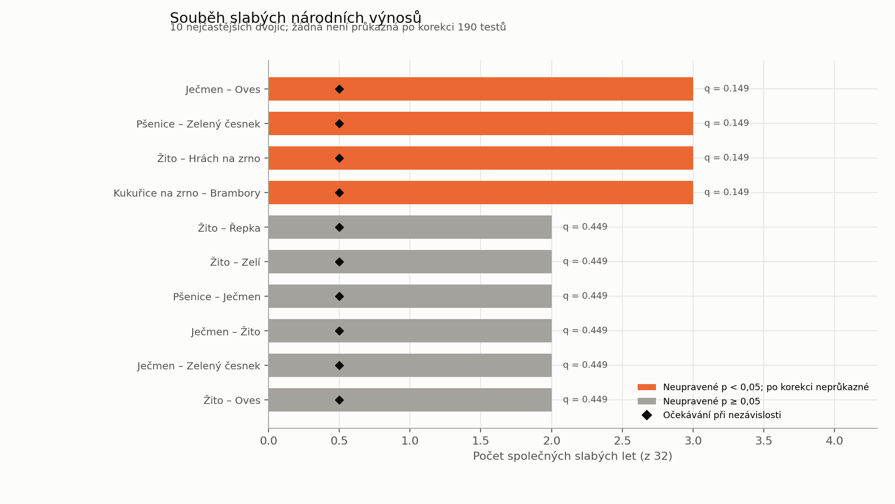

# Souběh slabých národních výnosů

## Shrnutí

V datech národních výnosů za roky 1993–2024 jsme pro 20 plodin hledali dvojice, které měly neobvykle slabý výnos ve stejných letech. Čtyři dvojice sdílely tři slabé roky, zatímco při nezávislosti by průměrně připadlo 0,5 společného roku. Po korekci 190 testovaných dvojic ale žádná dvojice nedosáhla hladiny významnosti 5 % (nejnižší upravená hodnota q = 0,149).

**Závěr:** Výsledky jsou zajímavé jako průzkumný popis společných národních šoků, ale neposkytují dostatečný důkaz pro omezení osevního plánu podle konkrétních dvojic plodin. Navíc neříkají, zda byly plodiny pěstovány na stejném poli nebo farmě.

## Metoda

Zdrojová tabulka obsahuje roční národní výnos každé plodiny, nikoli údaje o jednotlivých farmách či polích. Aby se za slabý výnos automaticky nepovažovala nízká úroveň z dřívějších desetiletí, pracujeme s logaritmem výnosu a pro každou plodinu odstraníme její lineární časový trend. Slabým rokem je rok v dolním decilu trendově očištěných výnosů. V této řadě to jsou čtyři roky na plodinu.

Pro každou ze 190 dvojic plodin počítáme počet společných slabých let a očekávaný počet při nezávislosti. Souběh testujeme jednostranným hypergeometrickým testem; hodnoty p upravujeme metodou Benjamini–Hochberg, aby se zohlednilo testování mnoha dvojic.

## Výsledky

| Dvojice | Společné slabé roky | Pozorováno | Očekáváno při nezávislosti | p | Upravené q |
|---|---|---:|---:|---:|---:|
| Pšenice – zelený česnek | 2003, 2006, 2012 | 3 | 0,50 | 0,0031 | 0,149 |
| Ječmen – oves | 2006, 2007, 2010 | 3 | 0,50 | 0,0031 | 0,149 |
| Žito – hrách na zrno | 2002, 2010, 2024 | 3 | 0,50 | 0,0031 | 0,149 |
| Kukuřice na zrno – brambory | 1994, 1995, 2015 | 3 | 0,50 | 0,0031 | 0,149 |

Čtyři dvojice mají neupravené p < 0,05, ale po korekci žádná nemá q < 0,05. Jde tedy o kandidáty k dalšímu ověření, ne o potvrzené specifické rizikové kombinace. „Slabý rok“ je zde relativní statistická definice; neznamená automaticky ztrátu nebo úplné selhání sklizně.

Úplné párové výsledky jsou v [CSV tabulce](vystupy/detaily/dvojice_slaby_vynos_narodni.csv), matice počtů společných slabých let v [dalším CSV](vystupy/detaily/souběh_slabych_vynosu_narodni.csv).

## Dopad na osevní plán

Tato analýza sama o sobě není důvod přidávat omezení typu „nesázet plodiny A a B společně“. Národní roční řady neukazují společnou výsadbu ani místní podmínky konkrétní farmy a žádná dvojice neprošla korekcí vícenásobného testování.

Pro řízení finančního rizika farmy je vhodnější zachovat společné scénáře cen a výnosů a optimalizovat výsledek celého portfolia pomocí mean-CVaR. Ten penalizuje nízký zisk v nejhorších scénářích bez potřeby zavádět nepodložené párové zákazy. K přímému ověření souběhu neúrody na farmě by byly potřeba víceleté záznamy výnosů a ploch po jednotlivých plodinách a farmách či polích.
